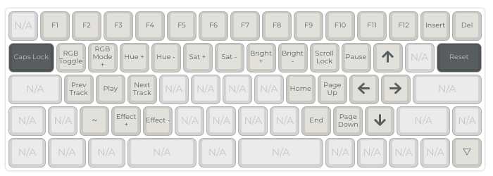

# Keebzord ⌨️

This is the repo with my `keymap.json` and `firmware.hex`, for my keeb.

Specs:

- dz60 rev 3 usb-c
- halo true switches
- kbdfans bamboo case
- enjoypbt 9009 keycaps
- layout almost pure hhkb

**My keeb**

## Layouts

These are the Keebzord's layers

### Layer 0

### Layer 1

### Layer 2

### Instructions

Upload the `keymap.json` to the [QMK Configurator](https://config.qmk.fm/#/dz60/LAYOUT)

Compile and download the firmware.

Flash it with [QMK Toolbox](https://qmk.fm/toolbox/)

Or just use the `firmware.hex` in this repo
